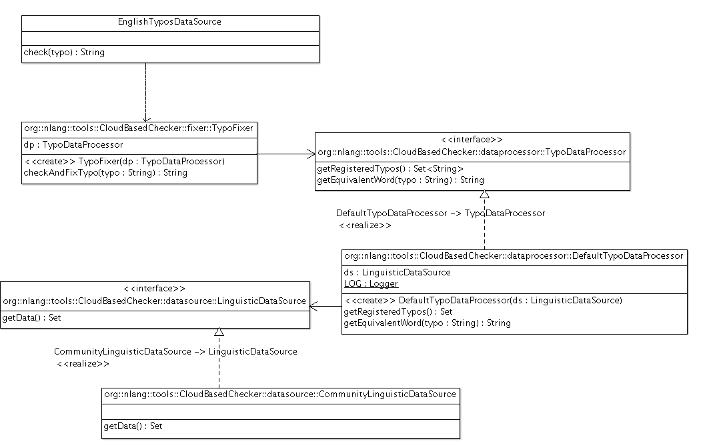

##Escuela Colombiana de Ingeniería
###Procesos de Desarrollo de Software - PDSW
###Laboratorio - Patrones GoF - Patrones estructurales

__Procesador de palabas con artefactos linguísticos - continuación.__

Recientemente se hizo un cambio a la aplicación base sobre la cual usted hizo el último ejercicio. En particular, ahora la aplicación funciona por defecto en Inglés, y el módulo de corrección de errores tipográficos correspondiente (clase EnglishTyposDataSource) fue modificado, de manera que en lugar de tener un conjunto estático de tuplas [error,equivalencia], ahora recurre a una librería provista por un tercero (

