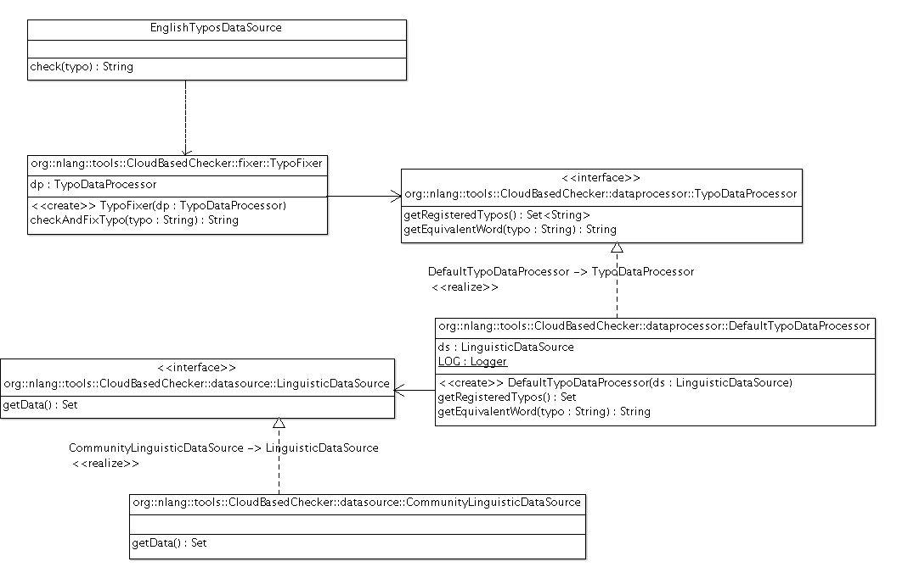

##Escuela Colombiana de Ingeniería
###Procesos de Desarrollo de Software - PDSW
###Laboratorio - Patrones GoF - Patrones estructurales (Adaptador / Proxy)

__Procesador de palabas con artefactos linguísticos - continuación.__

Recientemente se hizo un cambio a la aplicación base sobre la cual usted hizo el último ejercicio. En particular, ahora la aplicación funciona por defecto en Inglés, y el módulo de corrección de errores tipográficos en inglés correspondiente (clase EnglishTyposDataSource) fue modificado, de manera que en lugar de tener un conjunto estático de tuplas [error,equivalencia], ahora recurre a una librería provista por un tercero (revise el archivo pom.xml) para identificar y corregir un mayor número de posibles errores tipográficos.

El siguiente, es el modelo de las nuevas clases que ahora usa la clase EnglishTypoDataSource:



Como se observa, la clase TypoFixer es ahora a la que se le delega la evaluación de errores tipográficos. Dicha clase, a su vez, requiere de una clase de tipo 'TypoDataProcesor', la cual ofrece dos métodos: consulta de los errores tipográficos soportados (getRegisteredTypos()), y la consulta de la palabra correcta, a partir de la palabra errónea indicada(getEquivalentWord()). Por ahora, se cuenta con una implementación de ésta interfaz con la clase DefaultTypoDataProcessor, la cual, a su vez, depende de una clase de tipo LinguisticDataSource (la cual provee datos linguísticos 'en bruto'). De dicha interaz se cuenta, por ahora, con la implementación realizada en la clase CommunityLinguisticDataSource.

Con esto, ahora el corrector de errores tipográficos en inglés funciona así (ahora, sin datos estáticos):

```java
	public String check(String word){
            
            TypoFixer tf=new TypoFixer(new DefaultTypoDataProcessor(new CommunityLinguisticDataSource()));
            
            try {
                String res=tf.checkAndFixTypo(word);
                return res;
            } catch (NoTypoFoundException ex) {
                return null;
            }
	}
```

Al compilar y ejecutar la aplicación, encontrará que ésta ahora corrige un mayor número de errores, tales como:

* "yeilding"/"yielding"
* "yera"/"year"
* "yrea"/"year"
* "yeras"/"years"
* "yersa"/"years"
* "yotube"/"youtube"

Por otro lado, al revisar la consola, podrá observar que se están generando unos LOGs para poder hacer seguimiento de cuantas veces y cuanto tiempo toma buscar las palabras que corresponden a los posibles errores tipográficos:

```java
Jan 28, 2016 2:18:22 PM org.nlang.tools.CloudBasedChecker.dataprocessor.DefaultTypoDataProcessor getEquivalentWord
INFO: 23 words compared in 3ms
```

Se le ha pedido revisar lo siguiente:

1. Se ha aprobado usar el esquema antes descrito para la corrección de errores tipográficos del inglés. Sin embargo, se quiere a la clase DefaultTypoDataProcessor conectarle una fuente de datos disponible en la Nube (que cuenta con una base de datos de miles de errores), la cual es accesible a través de una clase provista por otra empresa:

	

2. Se ha encontrado que cuando el tamaño de los datos provisto por la fuente de datos aumenta, el tiempo de respuesta del método getEquivalentWord() crece linealmente, lo cual relentiza el tiempo de respuesta del editor de texto (verifíquelo usted mismo, cuando haya resuelto el punto 1.). Esto significa que dicho método tiene una complejidad O(N), lo cual lo hace inviable en la medida que la base de datos de errores crezca. Por tal razón, se le ha pedido hacer lo que sea necesario para seguir usando la clase DefaultTypoDataProcesor, pero que cuando a la misma se le pida una palabra equivalente a otra, lo haga con una complejidad del orden O(Log N). 


__Entregables.__

1. Para el martes:
	* Analizar: qué patrón es aplicable en cada caso?
	* Diagrama de clases de la solución planteada.
2. Para el jueves, antes del laboratorio: Solución completa.
